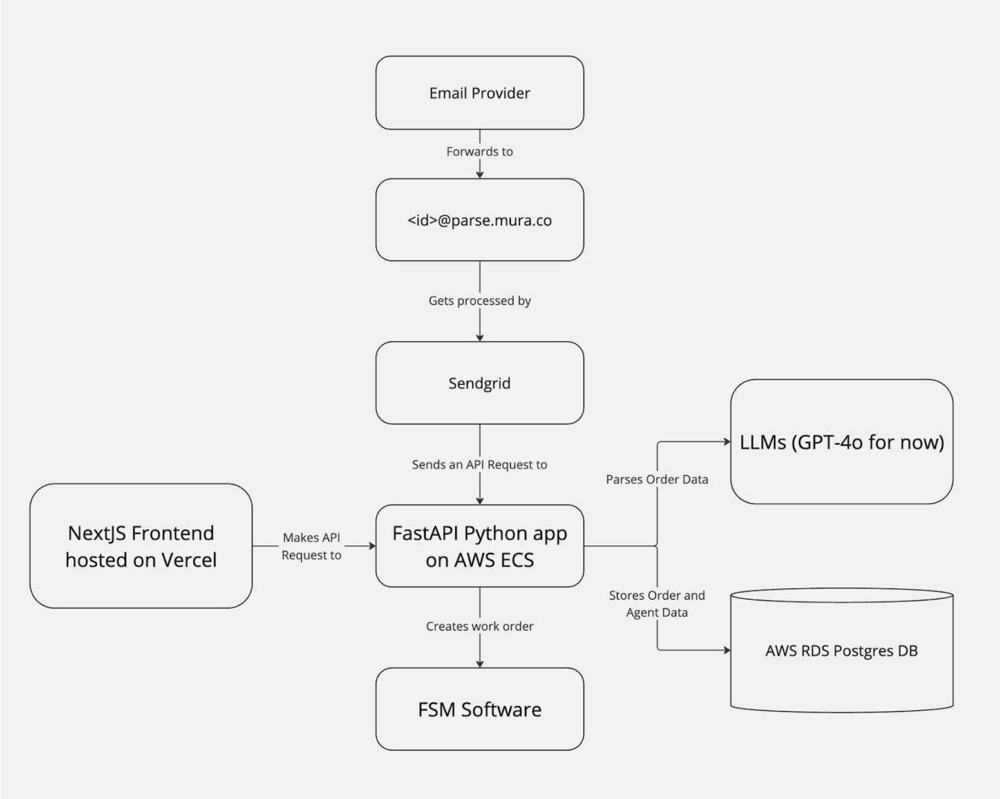

# AI-Powered Work Order Management System  
🚀 Automating work order processing using AI, FastAPI, and AWS  

---

## Overview  
This project automates work order creation from email requests using AI-powered parsing. It integrates email processing, a FastAPI backend, LLMs (GPT-4o), a PostgreSQL database.  

## Features  
✅ **Email Processing** – Automatically receives and parses work order requests.  
✅ **AI-Powered Parsing** – Uses GPT-4o to extract structured order details.  
✅ **Database Storage** – Stores work orders and agent data in PostgreSQL.  
✅ **Frontend Dashboard** – Next.js UI for tracking orders and managing requests.  
🛑 **FSM Integration** – Creates work orders in an FSM system for task execution.  

---

## Tech Stack  
- **Frontend**: [Next.js](https://nextjs.org/) (Hosted on Vercel)  
- **Backend**: [FastAPI](https://fastapi.tiangolo.com/) (Deployed on AWS ECS)  
- **AI/NLP**: [GPT-4o](https://openai.com/) for order parsing  
- **Database**: [PostgreSQL](https://www.postgresql.org/)  
- **FSM Software**: External integration for work order automation (Not implemented)

---

## System Architecture  
```
1. Email Request → Sent to SendGrid Parse
2. SendGrid → Forwards structured email data to FastAPI
3. FastAPI → Uses GPT-4o to extract order details
4. FastAPI → Stores extracted data in AWS RDS PostgreSQL
5. FastAPI → Creates work order in FSM software
6. Next.js Frontend → Displays orders and status updates
```

### Architecture Diagram  


---

## Installation & Setup  

### 1. Clone the Repository  
```bash
git clone https://github.com/pedrovs16/mura_test.git
cd mura_test
```

### 2. Backend Setup (FastAPI)  
#### Run conteiners  
```bash
cd backend
make up_d
```

#### Set Up Environment Variables  
Create a `.env` file in the `backend/` directory:  
```ini
APP_NAME=Mura test
HOST_APP_PORT=8000
HOST_DB_PORT=5432

DB_USER=postgres
DB_PASSWORD=postgres
DB_NAME=mura_test_db
DB_PORT=5432
DB_HOST=db

CHATGPT_API_KEY=key
CHATGPT_API_URL=https://api.openai.com/v1/
CHATGPT_MODEL=gpt-4o-mini-2024-07-18
```

---

### 3. Frontend Setup (Next.js)  
#### Install Dependencies  
```bash
cd frontend
npm install
```

#### Run Next.js Locally  
```bash
npm run dev
```

#### Set Up Environment Variables  
Create a `.env` file in the `frontend/` directory:  
```ini
NEXT_PUBLIC_API_URL=http://localhost:8000
```

---

## API Endpoints (FastAPI)  
| Endpoint | Method | Description |
|----------|--------|-------------|
| `/emails/` | `POST` | Creates a new email entry |
| `/emails/{id}` | `PUT` | Updates an existing email entry |
| `/emails/{id}` | `DELETE` | Deletes an email entry |
| `/emails/{id}` | `GET` | Retrieves an email entry by ID |
| `/emails/` | `GET` | Filters and paginates email entries |
| `/emails/receive` | `POST` | Receives and processes email content |
| `/orders/{id}` | `PUT` | Updates an existing orders entry |
| `/orders/{id}` | `DELETE` | Deletes an orders entry |
| `/orders/{id}` | `GET` | Retrieves an orders entry by ID |
| `/orders/` | `GET` | Filters and paginates orders entries |
| `/orders/receive` | `POST` | Receives and processes orders content |

---

## Missing Enhancements  
- ✅ Implement **user authentication** with Auth0.  
- ✅ Add more validators.  
- ✅ Unit tests.  
- ✅ Sendgrid integrations.
- ✅ FSM integration.
- ✅ Frontend css.
